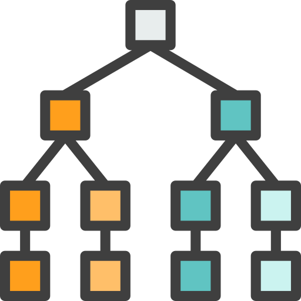

# Titanic Survival Prediction Using Decision Tree (CART) 

This project demonstrates **binary classification of Titanic passenger survival** using a **Decision Tree Classifier** with **Scikit-learn**.

The project uses passenger information such as **passenger class, sex, age, number of siblings/spouses, number of parents/children, fare, and port of embarkation** to predict whether a passenger **survived (`1`)** or **died (`0`)**.

The Decision Tree is built using the **CART (Classification and Regression Trees)** approach with **Gini Impurity** as the splitting criterion. The project follows a complete machine learning workflow, including data loading, data preprocessing, missing-value handling, categorical feature encoding, train-test splitting, model training, evaluation, decision-tree visualization, and prediction of previously unseen passenger data.

#### Key features of the project include,

- Loading and exploring a **real-world Titanic passenger dataset**.
- Selecting relevant passenger attributes for survival prediction.
- Handling missing values in the `Age` and `Embarked` columns.
- Using the **median** to replace missing age values.
- Using the **mode** to replace missing embarkation-port values.
- Separating input features (`X`) from the target variable (`Y`).
- Converting categorical features into numerical features using **One-Hot Encoding**.
- Using `drop_first=True` to avoid redundant categorical columns.
- Splitting the dataset into **80% training** and **20% testing** sets.
- Using `random_state=42` to ensure reproducible results.
- Building a **Decision Tree Classifier** using Scikit-learn.
- Using **Gini Impurity** to determine the quality of candidate splits.
- Limiting the tree to a maximum depth of **5** to help control overfitting.
- Evaluating the model using **accuracy**.
- Evaluating classification performance using a **confusion matrix**.
- Analysing **precision, recall, F1-score, and support** using the classification report.
- Displaying the trained tree structure using Scikit-learn's `plot_tree()`.
- Predicting survival for previously unseen passenger data.
- Obtaining class probabilities using `predict_proba()`.
- Demonstrating predictions using hypothetical **Jack Dawson** and **Rose DeWitt Bukater** passenger profiles.

---

## Project Structure

```text
titanic-survival-prediction-using-decision-tree/
│
├── titanic survival prediction using decision trees.ipynb
├── LICENSE.txt
├── requirements.txt
├── .gitignore
├── assets/
│   ├── titanic_passengers_dataset.csv
│   └── logo.png
└── README.md
```

> **Note:** The notebook and asset filenames may vary depending on the repository version. The dataset used by the code is located at `assets/titanic_passengers_dataset.csv`.

---

# Dataset

The project uses the well-known **Titanic passenger dataset**, which contains information about passengers who travelled on the RMS Titanic.

The dataset contains **891 passenger records** and includes demographic, travel, and ticket-related information.

The original dataset contains columns such as:

| Column | Description |
|--------|-------------|
| `PassengerId` | Unique identifier assigned to each passenger |
| `Survived` | Target variable: `0` = Died, `1` = Survived |
| `Pclass` | Passenger class: 1st, 2nd, or 3rd |
| `Name` | Passenger name |
| `Sex` | Passenger gender |
| `Age` | Passenger age |
| `SibSp` | Number of siblings or spouses aboard |
| `Parch` | Number of parents or children aboard |
| `Ticket` | Ticket number |
| `Fare` | Passenger fare |
| `Cabin` | Cabin number |
| `Embarked` | Port of embarkation |

For this machine learning project, only the following features are selected:

```text
Pclass
Sex
Age
SibSp
Parch
Fare
Embarked
```

The target variable is:

```text
Survived
```

---

# Understanding Titanic Survival Prediction

**Titanic survival prediction** is a binary classification problem in which a machine learning model learns patterns from historical passenger data and predicts whether a passenger survived.

The target variable has two possible classes:

| Value | Meaning |
|------:|---------|
| `0` | Died |
| `1` | Survived |

The overall machine learning process can be represented as:

```text
Titanic Passenger Data
          ↓
Data Selection
          ↓
Missing Value Handling
          ↓
One-Hot Encoding
          ↓
Train-Test Split
          ↓
Decision Tree Classifier
          ↓
Prediction
          ↓
Died (0) / Survived (1)
```

---

# What is a Decision Tree?

A **Decision Tree** is a supervised machine learning algorithm that can be used for both classification and regression problems.

For classification, a Decision Tree repeatedly divides the training data into smaller groups using decision rules based on feature values.

For example, a simplified decision process for Titanic survival might look like:

```text
Is Sex_male <= 0.5?
       /       \
     Yes        No
     /           \
Female          Male
  ↓               ↓
Survived?     Is Pclass <= 2.5?
               /        \
             Yes         No
             ↓            ↓
          Survive       Higher
                         risk
```

The actual trained tree contains more detailed rules involving features such as:

- `Sex_male`
- `Pclass`
- `Age`
- `Fare`
- `SibSp`
- `Parch`
- `Embarked_Q`
- `Embarked_S`

---

# CART - Classification and Regression Trees

This project uses the **CART (Classification and Regression Trees)** approach implemented by Scikit-learn's `DecisionTreeClassifier`.

For a classification problem, CART evaluates possible feature splits and selects a split that produces purer child nodes.

In this project, the splitting criterion is:

```python
criterion="gini"
```

This means that **Gini Impurity** is used to measure the quality of candidate splits.

The resulting tree contains:

- **Root node** - the first decision made by the tree.
- **Internal decision nodes** - nodes containing conditions used to split the data.
- **Branches** - paths representing the outcomes of decisions.
- **Leaf nodes** - final predictions made by the tree.

---

# Gini Impurity

**Gini Impurity** measures how mixed the classes are within a node.

For a binary classification problem, the Gini Impurity can be expressed as:

```text
Gini = 1 - (p₀² + p₁²)
```

where:

- `p₀` is the proportion of passengers belonging to class `0`.
- `p₁` is the proportion of passengers belonging to class `1`.

A node containing passengers from only one class has:

```text
Gini = 0
```

This represents a **pure node**.

A node containing a mixture of both classes has a higher Gini Impurity.

The Decision Tree attempts to select splits that produce child nodes with lower impurity.

---

# Project Workflow

The project follows the following machine learning workflow:

1. Import the required Python libraries.
2. Load the Titanic dataset.
3. Inspect the first five records.
4. Select relevant features.
5. Inspect data types and missing values.
6. Handle missing `Age` values using the median.
7. Handle missing `Embarked` values using the mode.
8. Separate features from the target variable.
9. Convert categorical features using One-Hot Encoding.
10. Split the dataset into training and testing sets.
11. Create the Decision Tree Classifier.
12. Train the model using the training dataset.
13. Determine the depth of the trained tree.
14. Determine the total number of tree nodes.
15. Generate predictions for the testing dataset.
16. Calculate model accuracy.
17. Generate the confusion matrix.
18. Generate the classification report.
19. Visualize the complete Decision Tree.
20. Create previously unseen passenger samples.
21. Predict survival for the new passengers.
22. Calculate prediction probabilities.

---

# Loading the Dataset

The Titanic dataset is loaded using Pandas:

```python
df = pd.read_csv("assets/titanic_passengers_dataset.csv")
```

The first five records can then be displayed using:

```python
print(df.head())
```

The dataset contains passenger information such as:

```text
PassengerId
Survived
Pclass
Name
Sex
Age
SibSp
Parch
Ticket
Fare
Cabin
Embarked
```

---

# Data Pre-Processing

Real-world datasets often contain irrelevant columns, missing values, and categorical data.

Therefore, data preprocessing is required before training the machine learning model.

The project performs three major preprocessing tasks:

1. Feature selection
2. Missing-value handling
3. One-Hot Encoding

---

# Feature Selection

Not every column in the original dataset is required for this prediction task.

The project selects the following columns:

```python
cols_to_keep = [
    'Pclass',
    'Sex',
    'Age',
    'SibSp',
    'Parch',
    'Fare',
    'Embarked',
    'Survived'
]

df_clean = df[cols_to_keep].copy()
```

The selected columns contain information that can be useful for predicting passenger survival.

The `Survived` column is retained because it is the target variable.

---

# Handling Missing Values

The original dataset contains missing values in:

```text
Age
Embarked
```

The dataset information before handling missing values shows:

| Column | Non-Null Values |
|--------|----------------:|
| `Age` | 714 |
| `Embarked` | 889 |
| Other selected columns | 891 |

Therefore, missing values must be handled before training the Decision Tree.

---

## Handling Missing Age Values

The median age is calculated:

```python
median_age = df_clean['Age'].median()
```

The missing values are then replaced:

```python
df_clean['Age'] = df_clean['Age'].fillna(median_age)
```

The **median** is used because it is less sensitive to extreme values than the mean.

After this step, all **891** passengers have an age value.

---

## Handling Missing Embarked Values

The most frequently occurring embarkation port is found using:

```python
most_common_port = df_clean['Embarked'].mode()[0]
```

Missing values are then replaced with the most common port:

```python
df_clean['Embarked'] = df_clean['Embarked'].fillna(most_common_port)
```

After this step, all **891** passengers have an `Embarked` value.

---

# Separating Features and Target

The input features are separated from the target variable.

The feature dataset is created using:

```python
x_raw = df_clean.drop('Survived', axis=1)
```

The target variable is:

```python
y = df_clean['Survived']
```

Therefore:

```text
X = Passenger information
Y = Survival status
```

The target variable represents:

```text
0 → Died
1 → Survived
```

---

# One-Hot Encoding

Machine learning algorithms generally require numerical input.

However, the dataset contains categorical features:

```text
Sex
Embarked
```

These categorical values are converted into numerical columns using **One-Hot Encoding**.

The project uses:

```python
x = pd.get_dummies(
    x_raw,
    columns=['Sex', 'Embarked'],
    drop_first=True
)
```

This produces the following feature columns:

```text
Pclass
Age
SibSp
Parch
Fare
Sex_male
Embarked_Q
Embarked_S
```

Therefore, the final feature dataset contains:

```text
8 input features
```

---

## Why Use `drop_first=True`?

The code uses:

```python
drop_first=True
```

This removes one category from each categorical feature.

For example, `Sex` contains:

```text
female
male
```

Instead of keeping both categories, one category can act as the reference category while the other is represented by a binary column:

```text
Sex_male
```

Similarly, the `Embarked` categories are represented using the necessary binary columns.

This avoids unnecessary redundant columns.

---

# Splitting the Dataset

The processed dataset is divided into training and testing sets using:

```python
X_train, X_test, Y_train, Y_test = train_test_split(
    x,
    y,
    test_size=0.2,
    random_state=42
)
```

The project uses:

- **80%** of the data for training.
- **20%** of the data for testing.
- `random_state=42` for reproducibility.

The resulting datasets are:

| Dataset | Samples | Features |
|---------|--------:|---------:|
| Training | 712 | 8 |
| Testing | 179 | 8 |
| Total | 891 | 8 |

The training set is used to learn the decision rules, while the testing set is used to evaluate how well the trained model performs on unseen data.

---

# Creating the Decision Tree Classifier

The Decision Tree is created using:

```python
clf = DecisionTreeClassifier(
    criterion="gini",
    max_depth=5,
    random_state=42
)
```

### Model Configuration

| Parameter | Value | Purpose |
|-----------|-------|---------|
| `criterion` | `gini` | Uses Gini Impurity to evaluate splits |
| `max_depth` | `5` | Limits the maximum depth of the tree |
| `random_state` | `42` | Provides reproducible results |

---

# Why Limit the Tree Depth?

A Decision Tree can continue splitting the data until it creates very specific rules for the training examples.

If the tree becomes excessively deep, it can **overfit** the training data.

Overfitting occurs when the model learns the training examples too closely and performs poorly on unseen data.

The project therefore uses:

```python
max_depth=5
```

This limits the maximum number of decision levels from the root to a leaf.

It provides a balance between:

```text
Too Simple
     ↓
Underfitting
     ↓
Appropriate Tree
     ↓
Too Complex
     ↓
Overfitting
```

The trained tree has:

```text
Tree Depth: 5
```

---

# Training the Decision Tree

The model is trained using:

```python
clf.fit(X_train, Y_train)
```

During training, the Decision Tree learns decision rules from the passenger data.

For example, the tree may learn rules involving:

```text
Sex_male
Pclass
Age
Fare
SibSp
Parch
```

The model then uses these learned rules to classify previously unseen passengers.

---

# Trained Tree Properties

The trained Decision Tree has:

```text
Tree Depth: 5
Number of Nodes: 47
```

Therefore:

| Property | Value |
|----------|------:|
| Maximum Tree Depth | **5** |
| Total Number of Nodes | **47** |
| Input Features | **8** |
| Training Samples | **712** |

The number of nodes includes both internal decision nodes and leaf nodes.

---

# Model Evaluation

After training, the model is evaluated using the testing dataset.

Predictions are generated using:

```python
Y_predict = clf.predict(X_test)
```

The project evaluates the model using:

- Accuracy
- Confusion Matrix
- Classification Report

---

# Model Accuracy

The model achieves:

```text
Model Accuracy = 0.80
```

Approximately:

```text
80%
```

This means that the model correctly classified approximately **80% of the 179 testing passengers**.

The accuracy can be calculated using:

```python
accuracy = accuracy_score(Y_test, Y_predict)
```

Accuracy is calculated as:

```text
Correct Predictions
-------------------
Total Predictions
```

For this model:

```text
143 correct predictions / 179 test samples ≈ 80%
```

---

# Confusion Matrix

The model produces the following confusion matrix:

```text
[[95 10]
 [26 48]]
```

For this binary classification problem, the class order is:

```text
[0, 1]
```

where:

```text
0 = Died
1 = Survived
```

The confusion matrix can therefore be interpreted as:

| Actual / Predicted | Died (0) | Survived (1) |
|--------------------|---------:|-------------:|
| **Died (0)** | 95 | 10 |
| **Survived (1)** | 26 | 48 |

The matrix shows:

- **95** passengers were correctly predicted as having died.
- **10** passengers who died were incorrectly predicted as survivors.
- **26** passengers who survived were incorrectly predicted as having died.
- **48** passengers were correctly predicted as survivors.

For the positive class (`1 = Survived`):

```text
True Positives  = 48
False Positives = 10
False Negatives = 26
True Negatives  = 95
```

The confusion matrix provides more information than accuracy alone because it shows the types of classification errors made by the model.

---

# Classification Report

The classification report provides:

- Precision
- Recall
- F1-score
- Support

The model produces:

```text
              precision    recall  f1-score   support

           0       0.79      0.90      0.84       105
           1       0.83      0.65      0.73        74

    accuracy                           0.80       179
   macro avg       0.81      0.78      0.78       179
weighted avg       0.80      0.80      0.79       179
```

### Performance Summary

| Class | Meaning | Precision | Recall | F1-score | Support |
|------:|---------|----------:|-------:|---------:|--------:|
| `0` | Died | 0.79 | 0.90 | 0.84 | 105 |
| `1` | Survived | 0.83 | 0.65 | 0.73 | 74 |

---

# Understanding the Classification Metrics

## Precision

**Precision** measures how many of the passengers predicted as belonging to a particular class were actually members of that class.

For the `Survived` class:

```text
Precision = 0.83
```

This means that approximately **83% of passengers predicted as survivors were actually survivors**.

---

## Recall

**Recall** measures how many of the actual passengers belonging to a class were correctly identified.

For the `Survived` class:

```text
Recall = 0.65
```

This means that the model correctly identified approximately **65% of the passengers who actually survived**.

---

## F1-score

The **F1-score** combines precision and recall into a single metric.

For the `Survived` class:

```text
F1-score = 0.73
```

A higher F1-score generally indicates a better balance between precision and recall.

---

## Support

**Support** represents the number of actual samples belonging to each class in the testing dataset.

In this project:

```text
Died      = 105 passengers
Survived  = 74 passengers
```

---

# Interpreting the Model Performance

The model achieves approximately:

```text
80% Testing Accuracy
```

The classification report shows that the model performs differently for the two classes.

For passengers who **died (`0`)**:

- Precision: **0.79**
- Recall: **0.90**
- F1-score: **0.84**

For passengers who **survived (`1`)**:

- Precision: **0.83**
- Recall: **0.65**
- F1-score: **0.73**

The model has a relatively high recall for the `Died` class, meaning it correctly identifies many of the passengers who did not survive.

However, the recall for the `Survived` class is lower. This means that a considerable number of passengers who actually survived are incorrectly classified as having died.

Therefore, the **80% accuracy should not be considered in isolation**. The confusion matrix and classification report provide a more complete understanding of model performance.

---

# Decision Tree Visualization

The trained Decision Tree is visualized using Scikit-learn's `plot_tree()` function.

```python
plt.figure(figsize=(20, 10))

plot_tree(
    clf,
    feature_names=list(x.columns),
    class_names=["Died", "Survived"],
    filled=True,
    rounded=True
)

plt.title("Decision Tree for Titanic Passenger Survival Prediction")

plt.show()
```

The visualization displays:

- Feature used for each split
- Split threshold
- Gini Impurity
- Number of samples
- Class distribution
- Predicted class

Each node provides information that can be used to understand how the Decision Tree makes its decisions.

---

## Decision Tree Visualization

The resulting tree has a maximum depth of **5** and contains **47 nodes**.

The root node represents the first decision made by the model. Subsequent branches represent additional conditions used to divide passengers into increasingly homogeneous groups.

For example, the tree may contain rules such as:

```text
Sex_male <= 0.5
```

or:

```text
Pclass <= 2.5
```

These rules are learned automatically from the training data rather than manually specified by the programmer.

---

# Predicting Unknown Passenger Data

After training the model, it can be used to predict the survival outcome of previously unseen passenger data.

The project demonstrates this using two hypothetical passengers:

1. **Jack Dawson**
2. **Rose DeWitt Bukater**

The purpose of these examples is to demonstrate how a trained machine learning model can be used to make predictions for new data.

---

# Predicting Jack Dawson

The following passenger profile is used:

| Feature | Value |
|---------|------:|
| `Pclass` | 3 |
| `Age` | 20 |
| `SibSp` | 0 |
| `Parch` | 0 |
| `Fare` | 7.25 |
| `Sex_male` | 1 |
| `Embarked_Q` | 0 |
| `Embarked_S` | 1 |

The model predicts:

```text
Prediction: Jack Dawson would have Died.
```

The predicted probabilities are:

```text
Died:      0.87
Survived:  0.13
```

Therefore, the model predicts:

```text
87% probability of Died
13% probability of Survived
```

The predicted class is:

```text
0 → Died
```

---

# Predicting Rose DeWitt Bukater

The following passenger profile is used:

| Feature | Value |
|---------|------:|
| `Pclass` | 1 |
| `Age` | 17 |
| `SibSp` | 0 |
| `Parch` | 2 |
| `Fare` | 700.00 |
| `Sex_male` | 0 |
| `Embarked_Q` | 0 |
| `Embarked_S` | 1 |

The model predicts:

```text
Prediction: Rose DeWitt Bukater would have Survived.
```

The predicted probabilities are:

```text
Died:      0.02
Survived:  0.98
```

Therefore, the model predicts:

```text
2% probability of Died
98% probability of Survived
```

The predicted class is:

```text
1 → Survived
```

---

# Understanding `predict()` and `predict_proba()`

The project uses two different prediction methods.

## `predict()`

```python
prediction = clf.predict(data)
```

`predict()` returns the predicted class.

For example:

```text
0 → Died
1 → Survived
```

---

## `predict_proba()`

```python
probability = clf.predict_proba(data)
```

`predict_proba()` returns the estimated probability for each class.

For example:

```text
[0.87, 0.13]
```

can be interpreted as:

```text
Died:      87%
Survived:  13%
```

This is useful when we want more information than the predicted class alone.

---

# Model Performance Summary

| Metric / Property | Value |
|-------------------|------:|
| Dataset Samples | **891** |
| Training Samples | **712** |
| Testing Samples | **179** |
| Input Features | **8** |
| Maximum Tree Depth | **5** |
| Number of Nodes | **47** |
| Splitting Criterion | **Gini Impurity** |
| Testing Accuracy | **80%** |
| Died Class F1-score | **0.84** |
| Survived Class F1-score | **0.73** |

The Decision Tree achieves approximately **80% testing accuracy** on the Titanic dataset.

The model performs particularly well at identifying passengers who did not survive, with a recall of **0.90** for class `0`.

However, the recall for survivors is **0.65**, indicating that the model misses a number of passengers who actually survived.

---

# Why Decision Trees Are Useful

Decision Trees have several advantages:

- Easy to understand and interpret.
- Can represent complex decision rules.
- Require relatively little data preprocessing.
- Can work with numerical and encoded categorical features.
- The resulting tree can be visualized.
- Predictions can be explained by following a path through the tree.
- Useful for both classification and regression tasks.

However, Decision Trees can also overfit when they become excessively deep.

This project controls tree complexity using:

```python
max_depth=5
```

---

# Advantages and Limitations of This Model

## Advantages

- Simple and interpretable classification model.
- Easy to visualize.
- Decision rules can be directly inspected.
- Supports probability predictions.
- Requires no feature scaling for the Decision Tree algorithm.
- Demonstrates the CART classification approach.
- Provides multiple evaluation metrics.

## Limitations

- The model is trained using only a selected set of passenger features.
- The Titanic dataset contains historical data and may not generalize to other populations.
- A single Decision Tree can be sensitive to the training data.
- Limiting the tree depth can reduce overfitting but may also prevent the model from learning some complex patterns.
- The model's predictions should be interpreted as machine learning predictions rather than historical certainty.

---

# Used Technologies

- Python
- Pandas
- Matplotlib
- Scikit-learn
- Jupyter Notebook

### Machine Learning Techniques

- Binary Classification
- Decision Tree Classification
- CART
- Gini Impurity
- Train-Test Split
- One-Hot Encoding
- Missing-Value Handling
- Confusion Matrix
- Classification Report
- Accuracy Evaluation
- Prediction Probabilities
- Decision Tree Visualization

### Used Integrated Development Environment

- VS Code

---

# How to Use?

Clone this repository:

```bash
git clone https://github.com/PubuduJ/titanic-survival-prediction-using-decision-tree.git
```

Navigate to the project directory:

```bash
cd titanic-survival-prediction-using-decision-tree
```

Install the required dependencies:

```bash
pip install -r requirements.txt
```

Alternatively, install the required libraries directly:

```bash
pip install pandas matplotlib scikit-learn
```

Open the Jupyter Notebook using **Jupyter Notebook**, **JupyterLab**, **VS Code**, or your preferred IDE.

Make sure the Titanic dataset is available at:

```text
assets/titanic_passengers_dataset.csv
```

Run the notebook cells sequentially to reproduce the data preprocessing, model training, evaluation, visualization, and prediction results.

---

# Learning Outcomes

This project demonstrates how to:

- Understand the fundamentals of **binary classification**.
- Work with a real-world machine learning dataset.
- Identify relevant features for a classification problem.
- Inspect a dataset using Pandas.
- Identify and handle missing values.
- Understand the difference between **median** and **mode** imputation.
- Separate input features from a target variable.
- Convert categorical data into numerical features using **One-Hot Encoding**.
- Understand the purpose of `drop_first=True`.
- Split a dataset into training and testing sets.
- Understand the purpose of `random_state`.
- Build a Decision Tree Classifier using Scikit-learn.
- Understand the **CART** approach to decision-tree classification.
- Understand **Gini Impurity**.
- Understand how a Decision Tree selects splitting rules.
- Understand the purpose of `max_depth`.
- Identify the depth and number of nodes in a trained Decision Tree.
- Evaluate a classification model using **accuracy**.
- Interpret a **confusion matrix**.
- Analyse **precision, recall, F1-score, and support**.
- Visualize a trained Decision Tree.
- Understand decision rules represented by tree nodes.
- Generate predictions for previously unseen data.
- Use `predict_proba()` to obtain class probabilities.
- Understand the difference between prediction and prediction probability.
- Recognize the importance of evaluating classification performance using multiple metrics.

---

# Version

**v1.0.0**

---

# License

Copyright &copy; 2026 [**Pubudu Janith**](https://www.linkedin.com/in/pubudujanith/). All Rights Reserved.

This project is licensed under the [**MIT License**](LICENSE.txt).